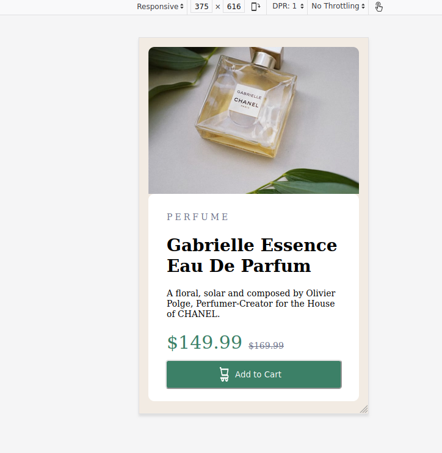

# Frontend Mentor - Product preview card component solution

This is a solution to the [Product preview card component challenge on Frontend Mentor](https://www.frontendmentor.io/challenges/product-preview-card-component-GO7UmttRfa). Frontend Mentor challenges help you improve your coding skills by building realistic projects. 

## Table of contents

- [Overview](#overview)
  - [The challenge](#the-challenge)
  - [Screenshot](#screenshot)
  - [Links](#links)
- [My process](#my-process)
  - [Built with](#built-with)
- [Author](#author)

**Note: Delete this note and update the table of contents based on what sections you keep.**

## Overview
frontend Mentor product card challenge

### The challenge
Using HTML and CSS to create a product card

Users should be able to:

- View the optimal layout depending on their device's screen size
- See hover and focus states for interactive elements

### Screenshot

### Links

- Solution URL: [https://github.com/brianoshinbolu-dev/Product_card.git](https://github.com/brianoshinbolu-dev/Product_card.git)
- Live Site URL: [https://product-card-eight-tau.vercel.app/](https://product-card-eight-tau.vercel.app/)

## My process

### Built with

- Semantic HTML5 markup
- CSS custom properties
- Flexbox
- CSS Grid
- Mobile-first workflow

## Author

- Website - [Brian Oshinbolu](https://portfolio-tan-one-53.vercel.app/)
- Frontend Mentor - [@brianoshinbolu-dev](https://www.frontendmentor.io/profile/brianoshinbolu-dev)
- Twitter - [@BOshinbolu](https://twitter.com/BOshinbolu)

